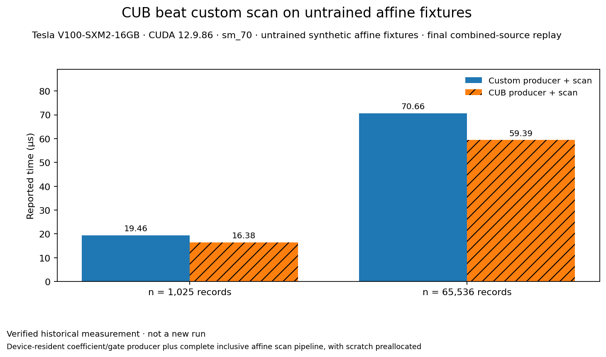

# CUB beat custom scan on untrained affine fixtures

**Evidence state:** verified historical

Did custom hierarchical scan lower the cost of the same bounded affine-summary computation?

In these untrained synthetic affine-summary fixtures, CUB had a lower recorded median than the custom scan at both tested sizes. The defined ordered summary composed exactly across two levels with source intervals, but this does not establish sequence utility or a learned genomic hierarchy.



| Case | Custom producer + scan (ms) | CUB producer + scan (ms) |
|---|---:|---:|
| n = 1,025 records | 0.019456 | 0.016384 |
| n = 65,536 records | 0.070656 | 0.059392 |

## What was measured

**Scope:** Device-resident coefficient/gate producer plus complete inclusive affine scan pipeline, with scratch preallocated. **Statistic:** Median of 31 device-event samples in one recorded invocation. **Uncertainty:** P95 values are retained in each raw receipt; no confidence interval or independent repeat is available.

**Hardware:** Tesla V100-SXM2-16GB / sm_70

**Cuda:** 12.9.86 (cudart 12090)

**Precision:** float, Release without fast math (as recorded)

**Warmups:** 3 device-pipeline calls before timing, confirmed by the recorded driver

**Repeats:** 31 timed samples per variant at each size; one invocation per receipt

**Source:** Final integrated replay; all six recorded SHA-256 source hashes match the current lab files.

## Interpretation and limits

- Synthetic four-float records with untrained fixture parameters; no biological sequence labels or genome-derived inputs.
- Device-resident pipeline only: excludes allocation, host fixture construction, H2D/D2H, and result interpretation.
- The two sample sizes and variants are one recorded invocation each (31 timed samples); p95 is not a confidence interval.
- The final combined-source replay is distinct from earlier per-case receipts. This result uses only the final combined-source receipts and does not pool them.
- This is an exactness/cost observation for a restricted affine operator, not evidence of general context construction or information preservation.
- Tracked raw receipts contain the original machine-local binary path in their command field; their recorded stdout is path-independent, and the reproduction recipe below uses relative repository commands.

## Reproduce / inspect

Historical recipe only; no rerun was made for this documentation pass. With CUDA 12.9, sm_70, and the canonical controller holding the assigned GPU resource, use:

```sh
python3 experiments/cuda_lab/tools/run.py \
  --phase build-cuda \
  --build-dir build-bitop-BP-CUDA-LAB-final-cuda
python3 experiments/cuda_lab/results/\
selection/replay.py parent
python3 experiments/cuda_lab/tools/\
check.py --all-results
```

The replay runs the recorded all-case sanitizer and benchmark checks. Do not invoke its GPU work without the actual exclusive resource lease.

[Original recorded explanation](../../experiments/cuda_lab/results/selection/report.md) · observed 2026-09-29 at `e37f85b4f651a1cddfcb481610ecff94e735d03f`.

Inspected implementation: [driver.cu](../../experiments/cuda_lab/cuda/driver.cu).

Measurement source: `Final combined-source replay; source hashes are recorded in results/selection/source_hashes.json.` (different from the current document-read revision where stated).

Portable evidence: [report.md](../../experiments/cuda_lab/results/selection/report.md), [final-bench-1025.json](../../experiments/cuda_lab/results/selection/final-bench-1025.json), [final-bench-65536.json](../../experiments/cuda_lab/results/selection/final-bench-65536.json), [source_hashes.json](../../experiments/cuda_lab/results/selection/source_hashes.json), [final-memcheck.json](../../experiments/cuda_lab/results/selection/final-memcheck.json), [final-initcheck.json](../../experiments/cuda_lab/results/selection/final-initcheck.json), [final-racecheck.json](../../experiments/cuda_lab/results/selection/final-racecheck.json), [final-synccheck.json](../../experiments/cuda_lab/results/selection/final-synccheck.json).

[Chart/table input](data/bp-carryfold.json) · [All selected results](index.md)
